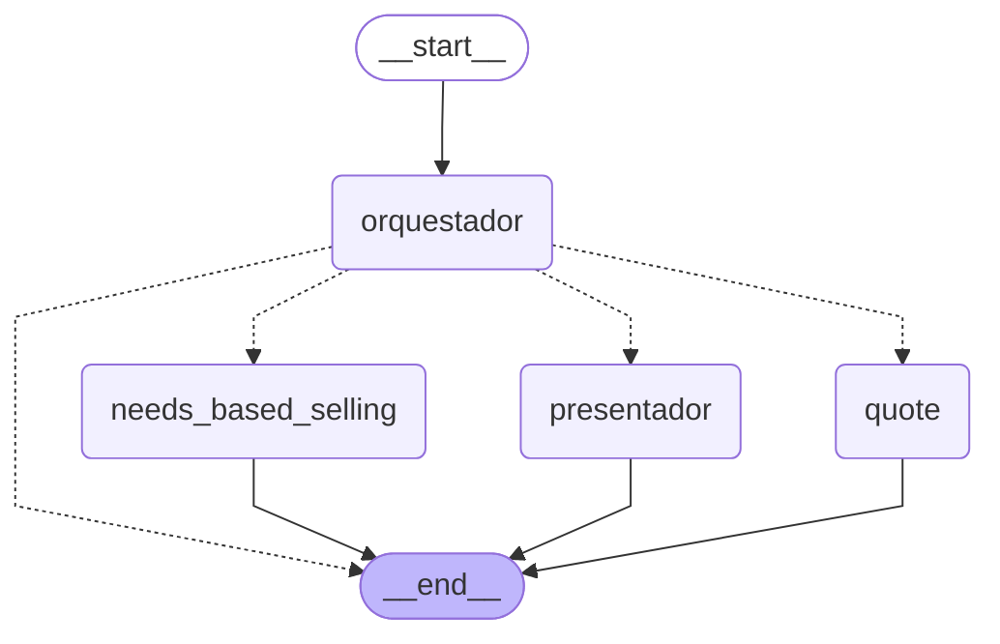

# iAgente_Vida - Grafo LangGraph

Generado con `graph.get_graph().draw_mermaid()`

## Diagrama Mermaid

## Visualización Online

1. Copia el código Mermaid de arriba
2. Ve a https://mermaid.live
3. Pega el código en el editor
4. Visualiza el diagrama interactivo
